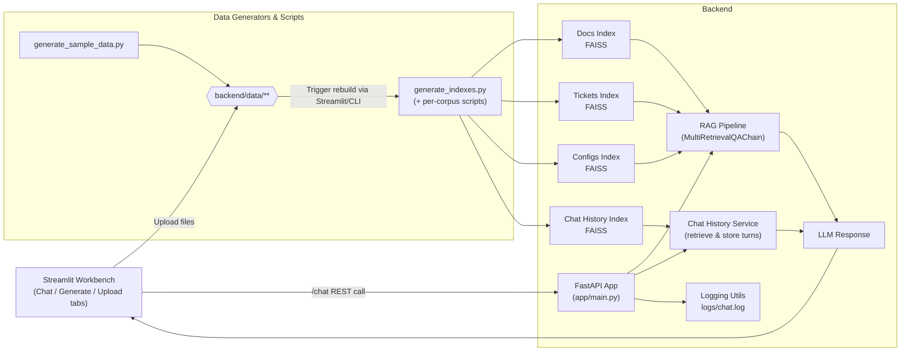

# 🏗️ RAG Chatbot Architecture

This document outlines the architecture of the RAG-powered chatbot demo application.

## System Overview

The application is a context-aware chatbot that uses Retrieval-Augmented Generation (RAG) to provide personalized responses based on multiple knowledge sources. It combines:
- Vector-based semantic chat history for topic-aware context
- LangChain for orchestrating LLM interactions

## Core Components

### 1. Frontend (`/frontend`)
- Streamlit workbench (`streamlit_app.py`) with tabs for Chat, Generate Data, Upload & Explore
- Chat tab drives `/chat` calls and surfaces persona selection + history summaries
- Generate Data / Upload tabs wrap the CLI scripts (data generation + FAISS rebuilds) so users rarely need a terminal
- Upload tab allows drag-and-drop of organizational docs/tickets/configs that are immediately re-indexed

### 2. Backend (`/backend`)

#### 2.1 API Layer (`app/main.py`)
- FastAPI application exposing chat endpoints
- Handles request/response lifecycle
- Coordinates between different components
- Manages user sessions and profiles

#### 2.2 Data Storage
- **Vector Stores** (`/data/`)
  - FAISS indexes for semantic search
  - Separate indexes for:
    - Documentation (`docs_index/`)
    - Support tickets (`tickets_index/`)
    - Config examples (`configs_index/`)
    - Chat history (`chat_history_index/`)
  - **(Future Scope)** The architecture is designed to potentially include a relational database like PostgreSQL for structured chat history, but the current implementation uses a vector-only approach for semantic memory.
- **Logs** (`/logs/chat.log`)
  - Rotating file handler writes to repo-root `logs/chat.log` regardless of the working directory

#### 2.3 Core Services

##### RAG Pipeline (`app/chains.py`)
- MultiRetrievalQAChain for unified search across domains
- Prompt templates for consistent response formatting
- Conversation memory for context awareness
- Default/fallback LLM chain consumes persona + chat history when a query does not map cleanly to docs/tickets/configs

##### Chat History Management (`app/chat_history.py`)
- **Vector-based Semantic Memory**:
- Chat history is stored exclusively in a FAISS vector store.
- This provides semantic similarity search to retrieve relevant historical context based on the current query topic, rather than sequential order.
- Embeds and stores chat turns

##### Tools & Utilities (`app/utils.py`)
- Utility functions for:
  - Profile fallback handling
  - Logging and monitoring
  - Session management

#### 2.4 Data Models (`app/models.py`)
- Pydantic-style models for in-memory data structures like `ChatTurn`.

#### 2.5 Configuration (`app/config.py`)
- Environment-specific settings
- Model configurations
- Database and storage paths
- Retrieval parameters

### 3. Index Generation (`/backend/scripts/`)
- Scripts for generating FAISS indexes
- Separate generators for each corpus:
  - `generate_docs_index.py`
  - `generate_tickets_index.py`
  - `generate_configs_index.py`
  - `generate_chat_history_index.py`
- Unified script (`generate_indexes.py`) for batch processing
- Streamlit’s Generate Data / Upload tabs shell out to these scripts automatically after each run/upload

## Data Flow

1. **User Input**
   - User sends query through frontend interface
   - Request includes user_id and session context

2. **Context Gathering**
   - System retrieves relevant chat history
   - Performs a semantic search on the chat history vector store to find relevant past turns
   - Applies user profile and preferences (defaults provided in `app/models.ChatRequest`)

3. **RAG Processing**
   - MultiRetrievalQAChain queries all vector stores
   - Relevant context is assembled and ranked
   - If the router cannot select docs/tickets/configs, the fallback LLM chain answers using persona details and chat history

4. **Response Generation**
   - LLM generates response using retrieved context
   - Response is formatted according to user preferences

5. **Storage & Indexing**
   - The user query and assistant response are embedded and added to the chat history vector store.
   - Logs are generated for monitoring
   - Streamlit tabs or CLI scripts rebuild FAISS indexes whenever synthetic or organizational data is added

## Dependencies

Core dependencies include:
- `fastapi` - Web API framework
- `langchain` - LLM orchestration
- `faiss-cpu` - Vector similarity search
- `openai` - LLM API access
- Additional utilities for environment management and data handling

## Security & Scalability

- Environment variable configuration for sensitive data
- Database connection pooling and session management
- Async/await patterns for API endpoints
- Error handling and logging throughout
- Profile fallback mechanisms for resilience
